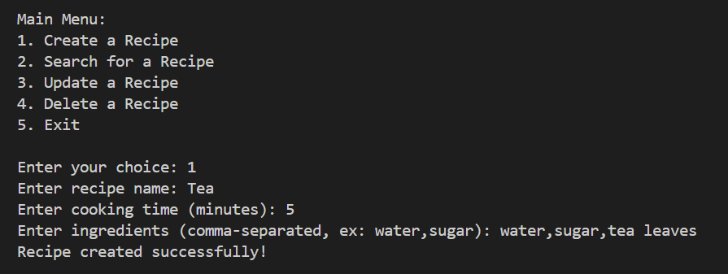
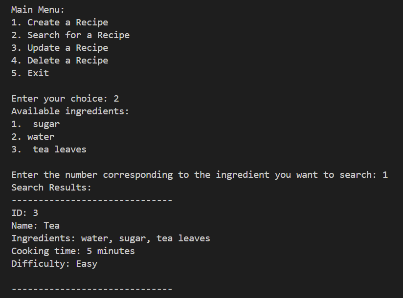
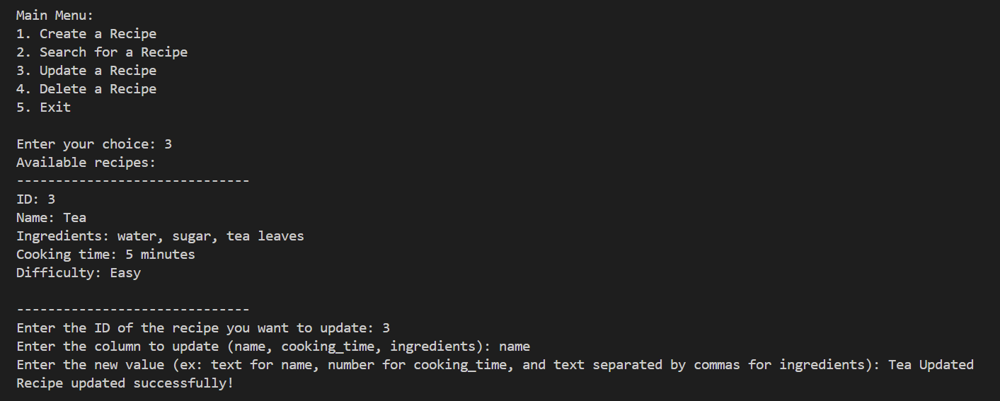
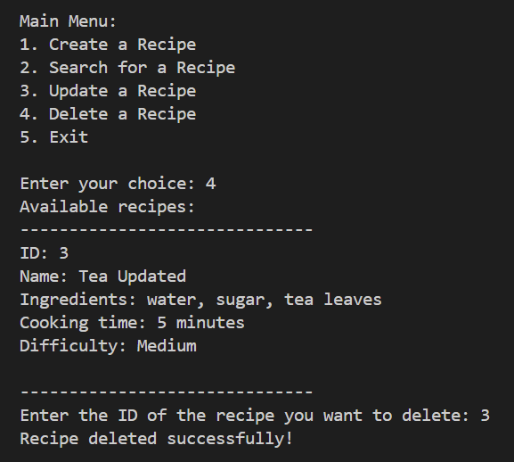
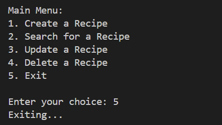
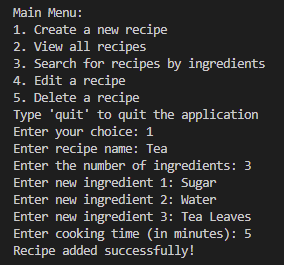
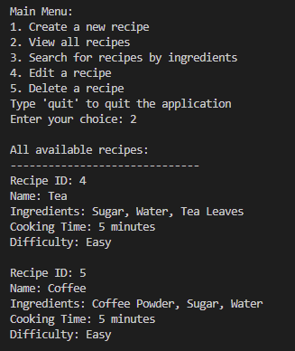
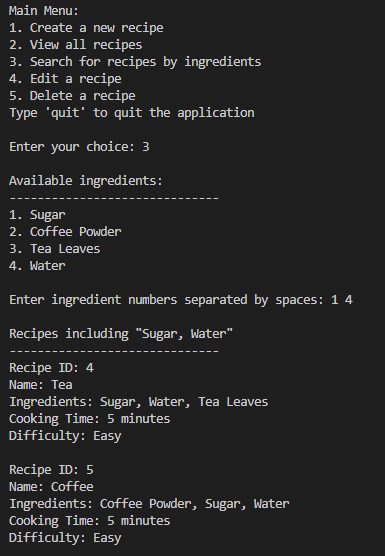
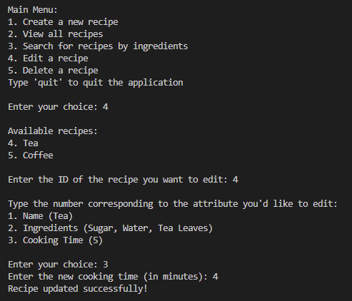
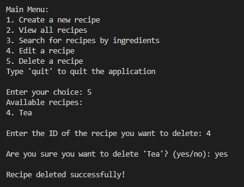

# Exercise 1
## Step 1 - Install Python
Install Python for your operating system and confirm that Python is installed by using the ```python --version``` command in your terminal.


## Step 2 - Set Up a Virtual Environment
Set up the [virtualenvwrapper-win](https://virtualenvwrapper.readthedocs.io/en/latest/install.html) package and then create a new virtual environment named "cf-python-base".


## Step 3 - Create a Python Script
Use your preferred text editor and create a Python script that prompts the user to input two numbers and adds them together, and then run the script from your terminal. The code for this is provided below.


```
# Prompt the user to enter the first number
a = int(input("enter first number: "))

# Prompt the user to enter the second number
b = int(input("enter second number: "))

# Add the two numbers and store the result in variable c
c = a + b

# Print the value of c
print("The sum of", a, "and", b, "is:", c)
```

## Step 4 - Set Up IPython Shell
Install the IPython Shell in the "cf-python-base" environment by running ```pip install ipython```. 
An IPython shell is similar to the regular Python REPL that you saw earlier but with additional features such as syntax highlighting, auto-indentation and robust auto-complete features. 

Verify your installation by launching an IPython shell with the command ```ipython```.


## Step 5 - Export and Use a Requirements File
The requirements file is a text file that lists package requirements for any particular Python application. The requirements file also helps when you’d like to run your Python script on another system. 

First, generate a “requirements.txt” file from the "cf-python-base" environment. To do this, you use the pip freeze command and all packages (including version numbers) installed in the currently activated environment will be compiled: ```pip freeze > requirements.txt```.

Next, create a new environment called “cf-python-copy” by running the command ```mkvirtualenv cf-python-copy```. In this new environment, install packages from the “requirements.txt” file that you generated earlier. 
To install the packages from this file in any other environment, you run the pip install command with the extra -r argument, followed by the name of your requirements file: ```pip install -r requirements.txt```.


# Exercise 2
## Step 1 - Create a structure for ```recipe_1```

The structure needs to contain the following keys:
- name (str): Contains the name of the recipe
- cooking_time (int): Contains the cooking time in minutes
- ingredients (list): Contains a number of ingredients, each of the str data type

For the structure of recipe_1, I would use a dictionary in Python. This is because a dictionary allows for easy association between keys and their corresponding values.

Here's the dictionary structure for the cup of tea recipe:
```
recipe_1 = {
    "name": "Tea",
    "cooking_time": 5,
    "ingredients": ["Tea leaves", "Sugar", "Water"]
}
```

## Step 2 - Create an outer structure called ```all_recipes```, and then add recipe_1 to it.

For the outer structure all_recipes, I would use a list of dictionaries. This allows for sequential storage of multiple recipes while maintaining the flexibility to add, modify, or remove recipes easily.

all_recipes = [recipe_1, ...other recipes]

I've also followed the same structure to create 4 more recipes and add them to the ```all_recipes``` list by using ```all_recipes.extend([recipe_2, recipe_3, recipe_4, recipe_5])```

## Step 3 - Print the ingredients of each recipe as five different lists

We can use a for loop to print the contents of the ingredients key of each recipe:

```
for recipe in all_recipes:
    print(recipe["ingredients"])

# Output
['Tea leaves', 'Sugar', 'Water']
['Eggs', 'Butter', 'Salt', 'Pepper', 'Milk']
['Spaghetti', 'Ground beef', 'Tomato sauce', 'Onion', 'Garlic', 'Parmesan cheese']
['Chicken', 'Curry powder', 'Coconut milk', 'Onion', 'Garlic', 'Ginger', 'Tomato']
['Flour', 'Sugar', 'Cocoa powder', 'Eggs', 'Butter', 'Milk', 'Vanilla extract']
```

# Exercise 1.3

## Step 1 - Initialize two empty lists: recipes_list and ingredients_list

```
recipes_list = []
ingredients_list = []
```

## Step 2 - Define a function called take_recipe, which takes input from the user for the following variables:
- name (str): Stores the name of the recipe.
- cooking_time (int): Stores the cooking time (in minutes).
- ingredients (list): A list that stores ingredients, each of the string data type.
- recipe (dictionary): Stores the name, cooking_time, and ingredients variables (e.g., recipe = {'name': name, 'cooking_time': cooking_time, 'ingredients': ingredients}).

```
def take_recipe():
    name = input("Name of the recipe: ")
    cooking_time = int(input("Cooking time (in minutes): "))
    ingredients = input("Ingredients (ex. Apples, Bananas, ...): ").split(", ")

    recipe = {
        "name": name,
        "cooking_time": cooking_time,
        "ingredients": ingredients
    }
    
    return recipe
```

## Step 3 - In the main section of your code, ask the user how many recipes they would like to enter. Their response will be linked to a variable n

```n = int(input("How many recipes would you like to enter? "))```

## Step 4 - Run a for loop, which runs n times to perform the following steps:

- Run take_recipe() and store its return output (a dictionary) in a variable called recipe.
- Run another for loop inside this loop, which iterates through recipe’s ingredients list, where it picks out elements one-by-one as ingredient. It will run the following step inside: if the chosen ingredient isn’t present in ingredients_list, add it to this list. To check if an element ele is present in a sequence seq, you can use the in keyword in a conditional statement as follows: if ele in seq:. Either True or False is returned (remember that you’re checking if ingredient is not in the list, so use the not operator accordingly).
- Once you’ve finished adding ingredients, append recipe to recipes_list.

```
for i in range(0,n):
    print("Recipe", i+1)
    recipe = take_recipe()

    for ingredient in recipe["ingredients"]:
        if not ingredient in ingredients_list:
            ingredients_list.append(ingredient)

    recipes_list.append(recipe)
```

## Step 5 - Run another for loop that iterates through recipes_list, picks out each element (a dictionary) as recipe, and performs the following steps:

1. Determine the difficulty of the recipe using the following logic:
    - If cooking_time is less than 10 minutes, and the number of ingredients is less than 4, set a variable called difficulty to the value of Easy.
    - If cooking_time is less than 10 minutes, and the number of ingredients is greater than or equal to 4, set a variable called difficulty to the value of Medium.
    - If cooking_time is greater than or equal to 10 minutes, and the number of ingredients is less than 4, set a variable called difficulty to the value of Intermediate.
    - If cooking_time is greater than or equal to 10 minutes, and the number of ingredients is greater than or equal to 4, set a variable called difficulty to the value of Hard.
  
2. Display the recipe in the following format, using values from each dictionary (recipe) obtained from recipes_list:
    

```
for recipe in recipes_list:
    difficulty = "Easy" if recipe["cooking_time"] < 10 and len(recipe["ingredients"]) < 4 else "Medium" if recipe["cooking_time"] < 10 and len(recipe["ingredients"]) >= 4 else "Intermediate" if recipe["cooking_time"] >= 10 and len(recipe["ingredients"]) < 4 else "Hard"

    print("\nRecipe: " + recipe["name"] + "\nCooking Time (min): " + str(recipe["cooking_time"]) + "\nIngredients:")
    for ingredient in recipe["ingredients"]:
        print(ingredient)
    print("Difficulty level:", difficulty)
```

## Step 6 - Next, you’ll have to display all the ingredients that you’ve come across so far in all of the recipes that you’ve just entered. In Step 5 you appended these ingredients into ingredient_list. Now it’s time to print them all out. Print them in alphabetical order, in a format similar to this example:


```
print("\nIngredients Available Across All Recipes\n-----------------------------------")
for ingredient in sorted(ingredients_list):
    print(ingredient)
```

# Exercise 1.4

## Part 1 - recipe_input.py script

### Step 1 - Import the pickle and os modules so you can work with binary files and interact with the files in your OS

```
import pickle
import os
```

### Step 2 - Define a function called take_recipe() to take recipes from the user, which performs the following operations:

- Taking in the recipe name, cooking time, and ingredients from the user.
- Calculating the difficulty of the recipe by calling thecalc_difficulty() function.
- Gathering all these attributes into a dictionary and returning it.

```
def take_recipe():
    name = input("Name of the recipe: ")
    cooking_time = int(input("Cooking time (in minutes): "))
    ingredients = input("Ingredients (ex. Apples, Bananas, ...): ").split(", ")
    difficulty = calculate_difficulty(cooking_time, ingredients)

    recipe = {
        "name": name,
        "cooking_time": cooking_time,
        "ingredients": ingredients,
        "difficulty": difficulty
    }

    return recipe
```

### Step 3 - Define the function calc_diffficulty(), where the difficulty is returned as Easy, Medium, Intermediate or Hard

```
def calculate_difficulty(cooking_time, ingredients):
    difficulty = "Easy" if cooking_time < 10 and len(ingredients) < 4 else "Medium" if cooking_time < 10 and len(
        ingredients) >= 4 else "Intermediate" if cooking_time >= 10 and len(ingredients) < 4 else "Hard"

    return difficulty
```

### Step 4 - Have the user enter a filename, which would attempt to open a binary file in read mode. Define a try-except-else-finally block as follows:

1. The try block will open the given file, and load its contents through the pickle module into a variable called data. If the file doesn't exist, the user will have an option to create it. The incoming data is expected to be a dictionary containing two key-value pairs:
    - recipes_list (a list of all recipes)
    - all_ingredients (a list of all ingredients across all recipes)
1. An except clause handles the FileNotFoundError exception if a file with the given name isn’t found. The code block after will create a new dictionary called data, which contains the recipes list under the key recipes_list and another list containing all the ingredients under all_ingredients.
1. Another except clause that handles other exceptions and performs the same operations as the first except block.
1. An else block that closes the file stream that would’ve been opened in the try block.
1. A finally block that extracts the values from the dictionary into two separate lists: recipes_list and all_ingredients.

```
filename = input("Enter the filename of your recipes: ")

try:
    if os.path.isfile("./" + filename):
        file = open(filename, 'rb')
        data = pickle.load(file)

        recipes_list = data["recipes_list"]
        all_ingredients = data["all_ingredients"]
        file.close()
        add_recipe()
    else:
        answer = input(
            "File doesn't exist, would you like to create and use it? (y/n) ")
        if answer == "y":
            add_recipe()
        elif answer == "n":
            print("Quitting...")
        else:
            print("Unrecognized command, quitting script...")

except FileNotFoundError:
    print("File doesn't exist - exiting.")
except:
    print("An unexpected error occurred.")
```

### Step 5 - Ask the user how many recipes they’d like to enter, and define a for loop that calls the take_recipe() function and then define an inner loop that scans through the recipe’s ingredients and adds them to all_ingredients if they’re not already there, then gather the updated recipes_list and all_ingredients into the dictionary called data

```
def add_recipe():
    # Ask user how many recipes they'd like to add
    n = int(input("How many recipes would you like to enter? "))

    # Take input for the number of recipes specified and append to recipe_list
    for i in range(0, n):
        print("Recipe", i+1)
        recipe = take_recipe()

        for ingredient in recipe["ingredients"]:
            if not ingredient in all_ingredients:
                all_ingredients.append(ingredient)

        recipes_list.append(recipe)

    data = {
        "recipes_list": recipes_list,
        "all_ingredients": all_ingredients
    }
```

### Step 6 - Finally, open a binary file with the user-defined filename and write data to it using the pickle module.

```
    file = open(filename, 'wb')
    pickle.dump(data, file)
    print('Data successfully written to "' + filename + '"')
    file.close()
```

## Part 2 - recipe_search.py Script

### Step 1 - Import the pickle module

```import pickle```

### Step 2 - Define a function to display a recipe called display_recipe(), which takes in one recipe (of the dictionary type) as an argument and prints all of its attributes including the recipe name, cooking time, ingredients, and difficulty

```
def display_recipe(recipe):

    print("\nRecipe: " + recipe["name"] + "\nCooking Time (min): " +
          str(recipe["cooking_time"]) + "\nIngredients:")
    for ingredient in recipe["ingredients"]:
        print(ingredient)
    print("Difficulty level:", recipe["difficulty"])
```

### Step 3 - Define another function called search_ingredient() to search for an ingredient in the given data. The function takes in a dictionary called data as its argument. The function will perform the following steps:

- First, it shows the user all the available ingredients contained in data, under the key all_ingredients. Each ingredient is displayed with a number (take the index of each ingredient for this purpose using the enumerate() function).
- Define a try block where the user gets to pick a number from this list. This number is used as the index to retrieve the corresponding ingredient, which is then stored into a variable called ingredient_searched.
- Make an except clause that warns the user if the input is incorrect.
- Add an else clause that goes through every recipe in data (hint: recipes_list is the key that holds every recipe). Each recipe that contains the given ingredient will be printed.

```
def search_ingredient(data):

    # making a copy of the data object to modify
    data_lower = data.copy()

    # convert all ingredients to lowercase so we can compare them regardless of which case they were originally in
    for recipe in data_lower["recipes_list"]:
        for ingredient in list(enumerate(recipe["ingredients"])):
            recipe["ingredients"][ingredient[0]] = ingredient[1].lower()

    for ingredient in list(enumerate(data_lower["all_ingredients"])):
        data_lower["all_ingredients"][ingredient[0]] = ingredient[1].lower()

    # turn all ingredients into a set which avoids duplicate ingredients, then sort it alphabetically
    all_ingredients = sorted(list(set(data_lower["all_ingredients"])))

    # show a list of all available ingredients
    print("\nAvailable ingredients:")
    for ingredient in list(enumerate(all_ingredients)):
        print(str(ingredient[0]+1) + ": " + ingredient[1])

    # display all recipes that include a user chosen ingredient
    try:
        ingredient_searched = int(input("\nSelect an ingredient from the list by entering its corresponding number: "))
    except:
        print("Invalid input, quitting...")
    else:
        try:
            print('\nList of recipes including ' + '"' +
                  all_ingredients[ingredient_searched - 1] + '":')
            for recipe in list(enumerate(data_lower["recipes_list"])):
                if all_ingredients[ingredient_searched - 1] in recipe[1]["ingredients"]:
                    print("\nRecipe " + str(recipe[0] + 1) + ": " + data["recipes_list"][recipe[0]]["name"] + "\nCooking Time (min): " + str(
                        data["recipes_list"][recipe[0]]["cooking_time"]) + "\nIngredients:")
                    for ingredient in data["recipes_list"][recipe[0]]["ingredients"]:
                        print(ingredient)
                    print("Difficulty level:",
                          data["recipes_list"][recipe[0]]["difficulty"])
        # handle exception where the inputted ingredient index is higher than what exists
        except IndexError:
            print("Item not found, quitting...")
```

### Step 4 - In the main code, ask the user for the name of the file that contains your recipe data

```filename = input("Enter the filename where you've stored your recipes: ")```

### Step 5 - Use a try block to open the file, and then extract its contents into data (from Step 3) using the pickle module. For when the try block fails, add an except block to warn the user that the file hasn’t been found. Define an else block that calls search_ingredient() while passing data into it as an argument.

```
try:
    file = open(filename, 'rb')
    data = pickle.load(file)
except FileNotFoundError:
    print("File doesn't exist - exiting.")
except:
    print("An unexpected error occurred.")
else:
    search_ingredient(data)
```

# Exercise 1.5

## Step 1 - Define a class Recipe, with the following data attributes:

- name: the name of a recipe
- ingredients: a list containing the ingredients for a recipe
- cooking_time: the time taken in minutes to carry out a recipe
- difficulty: an auto-generated attribute that says whether the recipe is Easy, Medium, Intermediate, or Hard

```
class Recipe:
    # Class variable to store all ingredients across all recipes
    all_ingredients = set()

    def __init__(self, name):
        # adding an underscore _ before each variable name to indicate that the variable is intended for internal use within the class.
        self._name = name
        self._ingredients = []
        self._cooking_time = None
        self._difficulty = None
```

## Step 2 - Define the following procedural attributes (methods) for the class as well:

- An initialization method that takes in the name for the recipe and initializes the other data attributes too. Getter and setter methods for name and cooking_time.
- A method called add_ingredients that takes in variable-length arguments for the recipe’s ingredients. For example, the arguments could be either ("Salt") or even ("Salt", "Pepper", "Flour", "Water", "Bananas", "Marzipan"); your method should take in these ingredients and add them to ingredients. Once all the ingredients are added, this function calls update_all_ingredients() , which you’ll define shortly.
- A getter method for ingredients that returns the list itself.
- A method called calculate_difficulty() that uses the logic in part 1 of this task, and updates the difficulty of the recipe.
- A getter method for difficulty which also calls calculate_difficulty() if difficulty hasn’t been calculated.
- A search method called search_ingredient() that takes an ingredient as an argument, searches for it in the recipe, and returns True or False appropriately.
- A method called update_all_ingredients() that goes through the current object’s ingredients and adds them to a class variable called all_ingredients, if they’re not already present. This class variable keeps track of all the ingredients that exist across all recipes.
- A string representation that prints the entire recipe over a well formatted string.

```
@property
    def name(self):
        return self._name

    @name.setter
    def name(self, value):
        self._name = value

    @property
    def cooking_time(self):
        return self._cooking_time

    @cooking_time.setter
    def cooking_time(self, value):
        self._cooking_time = value

    # the asterisk before ingredients indicates that the function can accept any number of positional arguments, which will be collected into a tuple.
    def add_ingredients(self, *ingredients):

        # the .extend() method is used to extend an existing list by appending elements from another iterable object, (in this case the ingredients tuple), 
        # such as a list, tuple, set, or any other iterable.
        self._ingredients.extend(ingredients)
        self.update_all_ingredients()

    @property
    def ingredients(self):
        return self._ingredients

    def calculate_difficulty(self):
        if self._cooking_time is None or self._ingredients is None:
            return
        if self._cooking_time < 10 and len(self._ingredients) < 4:
            self._difficulty = "Easy"
        elif self._cooking_time < 10 and len(self._ingredients) >= 4:
            self._difficulty = "Medium"
        elif self._cooking_time >= 10 and len(self._ingredients) < 4:
            self._difficulty = "Intermediate"
        else:
            self._difficulty = "Hard"

    @property
    def difficulty(self):
        # using the keyword "is" tests if two variables point to the same object instead of if they just have the same value
        # for example it would return false for these two lists: a = [1,2,3]; b = [1,2,3] as they point to different objects in memory
        if self._difficulty is None:
            self.calculate_difficulty()
        return self._difficulty

    def search_ingredient(self, ingredient):
        return ingredient in self._ingredients

    def update_all_ingredients(self):
        # The .update() method is primarily used to update the contents of a dictionary or set with the elements from another iterable object,
        # such as another dictionary, a list, or a set.
        #
        # In the case of sets like the Recipe class' shared "all_ingredients" set, the .update() method
        # adds elements from another iterable (self._ingredients) to the set.
        # If the elements (ingredients in this case) already exist in the set, they are ignored.
        Recipe.all_ingredients.update(self._ingredients)

    def __str__(self):
        # using f-strings, or formatted string literals for interpolation and easier formatting
        return f"{self._name}:\nIngredients: {', '.join(self._ingredients)}\nCooking time: {self._cooking_time} minutes\n"
```

## Step 3 - To find recipes that contain a specific ingredient, define a method called recipe_search():

1. Define 2 parameters for this method:
    - data: takes in a list of Recipe objects to search from
    - search_term: the ingredient to be searched for
1. Run a for loop that traverses through data, and performs the following steps:
    - Within the object that is in focus, call the search_ingredient method to see if the ingredient is present or not.
    - If the above condition is satisfied, print the recipe.

```
# Method used to find recipes that contain a specific ingredient
def recipe_search(data, search_term):
    for recipe in data:
        if recipe.search_ingredient(search_term):
            print(recipe)
```

## Step 4 - In the main code, make an object under the Recipe class:

- Initialize an object named tea under this class, and set the recipe’s name as "Tea" through the initialization step.
- Add the following ingredients to this recipe: Tea Leaves, Sugar, Water.
- Set the cooking time for this recipe as 5 (in minutes).
- Display the string representation of this object.
 
```
# Creating recipe objects
tea = Recipe("Tea")
tea.add_ingredients("Tea Leaves", "Sugar", "Water")
tea.cooking_time = 5
```

## Step 5 - Make a few more recipes with the given attributes, and display their respective string representations as well:

1. Coffee:
    - Ingredients: Coffee Powder, Sugar, Water
    - Cooking time: 5 minutes
2. Cake:
    - Ingredients: Sugar, Butter, Eggs, Vanilla Essence, Flour, Baking Powder, Milk
    - Cooking time: 50 minutes
3. Banana Smoothie:
    - Ingredients: Bananas, Milk, Peanut Butter, Sugar, Ice Cubes
    - Cooking time: 5 minutes

```
coffee = Recipe("Coffee")
coffee.add_ingredients("Coffee Powder", "Sugar", "Water")
coffee.cooking_time = 5

cake = Recipe("Cake")
cake.add_ingredients("Sugar", "Butter", "Eggs",
                     "Vanilla Essence", "Flour", "Baking Powder", "Milk")
cake.cooking_time = 50

banana_smoothie = Recipe("Banana Smoothie")
banana_smoothie.add_ingredients(
    "Bananas", "Milk", "Peanut Butter", "Sugar", "Ice Cubes")
banana_smoothie.cooking_time = 5

# Displaying string representations
print("String representations of a recipe:\n" + 30*"-")
print(tea)
print(coffee)
print(cake)
print(banana_smoothie)
print(30*"-")
```

## Step 6 - Wrap the recipes into a list called recipes_list.

```
# Creating a list of recipes
recipes_list = [tea, coffee, cake, banana_smoothie]
```

## Step 7 - Use the recipe_search() method to search for recipes that contain each ingredient out of: Water, Sugar, Bananas.

```
# Using recipe_search method to search for recipes containing specific ingredients
ingredients_to_search = ["Water", "Sugar", "Bananas"]
for ingredient in ingredients_to_search:
    print(f"Recipes containing {ingredient}:")
    recipe_search(recipes_list, ingredient)
    # print newline character at the end for better formatting
    print()
```

## Final output:

```
String representations of a recipe:
------------------------------
Tea:
Ingredients: Tea Leaves, Sugar, Water
Cooking time: 5 minutes

------------------------------
Recipes containing Water:
Tea:
Ingredients: Tea Leaves, Sugar, Water
Cooking time: 5 minutes

Coffee:
Ingredients: Coffee Powder, Sugar, Water
Cooking time: 5 minutes


Recipes containing Sugar:
Tea:
Ingredients: Tea Leaves, Sugar, Water
Cooking time: 5 minutes

Coffee:
Ingredients: Coffee Powder, Sugar, Water
Cooking time: 5 minutes

Cake:
Ingredients: Sugar, Butter, Eggs, Vanilla Essence, Flour, Baking Powder, Milk

Recipes containing Bananas:
Banana Smoothie:
Ingredients: Bananas, Milk, Peanut Butter, Sugar, Ice Cubes
Cooking time: 5 minutes
```

# Exercise 1.6

## Part 1: Create & Connect Database

Before you visualize anything to the user, you should connect your “recipe_mysql.py” script to your MySQL server:

1. First, import the mysql.connector module.

```import mysql.connector```

2. Next, initialize a connection object called conn, which connects with the following parameters, based on the user that you set up earlier:

    - Hostname is localhost
    - Username is cf-python
    - Password is password

```
def connect_to_database():
    # Connect to MySQL server
    conn = mysql.connector.connect(
        host="localhost",
        user="cf-python",
        password="password"
    )
```

3. Next, initialize a cursor object from conn.

```
    # Create a cursor object
    cursor = conn.cursor()
```

4. Create a database called task_database. To ensure you don’t get errors from accidentally using multiple databases with the same name, make sure it’s the only database with this name on the server by using the EXISTS statement: CREATE DATABASE IF NOT EXISTS <database name>

```
    # Create task_database if not exists
    cursor.execute("CREATE DATABASE IF NOT EXISTS task_database")
```

5. Have your script access your database with the USE statement.

```
    # Use task_database
    cursor.execute("USE task_database")
```

6. Create a table called Recipes with the following columns:
    - id: integer type; increments automatically; the primary key for this table.
    - name: string type; character limit of 50; stores the name of the recipe.
    - ingredients: string type; character limit of 255; stores the ingredients of the recipe in the form of a string.
    - cooking_time: integer type; stores the cooking time in minutes.
    - difficulty: string type; character limit of 20; stores the difficulty level as Easy, Medium, Intermediate, or Hard.

As you did with the database, use the EXISTS statement to make sure there isn’t already a table with the same name: CREATE TABLE IF NOT EXISTS <table name>

```
    # Create Recipes table if not exists
    cursor.execute("CREATE TABLE IF NOT EXISTS Recipes (id INT AUTO_INCREMENT PRIMARY KEY, name VARCHAR(50), ingredients VARCHAR(255), cooking_time INT, difficulty VARCHAR(20))")

    return conn, cursor
```

## Part 2: The Main Menu

To implement a main menu, let’s first understand how the user would flow through it:

- First, the user gets to choose from four options: adding recipes, searching for recipes, modifying recipes, and deleting recipes. Once the user selects an option, it should be launched through its own function call. When the function is over, the user needs to be taken back to the main menu so they can perform other operations.
- The process of user selection, function calling, and returning to the main menu requires a loop so that after the process has been completed once it can loop and happen again. A while loop would be perfect for this, because in this case you don’t know exactly how many times the loop will run.
- The condition for running the loop can be based on the user’s choice between the 4 options (adding recipes, searching for recipes, etc.). However, if the user were to enter a designated choice to exit the program, the loop would stop.

Therefore, your main_menu() function requires the following options:

1. Creating a new recipe: Calls a function called create_recipe() which accepts conn and cursor as its arguments.
2. Searching for a recipe by ingredient: Calls a function called search_recipe() which accepts conn and cursor as its arguments.
3. Updating an existing recipe: Calls a function called update_recipe() which accepts conn and cursor as its arguments.
4. Deleting a recipe: Calls a function called delete_recipe() which accepts conn and cursor as its arguments.

If the user exits this loop, any changes to the database would be committed and the connection created would be closed.

Once you've defined the main_menu() function, call it in the main code. Pass conn and cursor as arguments so that the code inside the main_menu() function can use the database.

```
def main_menu(conn, cursor):
    while True:
        print("\nMain Menu:")
        print("1. Create a Recipe")
        print("2. Search for a Recipe")
        print("3. Update a Recipe")
        print("4. Delete a Recipe")
        print("5. Exit")

        choice = input("\nEnter your choice: ")

        if choice == '1':
            create_recipe(conn, cursor)
        elif choice == '2':
            search_recipe(conn, cursor)
        elif choice == '3':
            update_recipe(conn, cursor)
        elif choice == '4':
            delete_recipe(conn, cursor)
        elif choice == '5':
            print("Exiting...")
            break
        else:
            print("Invalid choice. Please try again.")

    conn.close()


if __name__ == "__main__":
    conn, cursor = connect_to_database()
    main_menu(conn, cursor)
```

## Part 3: Creating a Recipe with create_recipe()

1. First, collect the following details for a recipe entry:
    - name: Name of the recipe, string type.
    - cooking_time: Cooking time of the recipe in minutes, integer type.
    - ingredients: Ingredients of the recipe, each ingredient stored as a string in this list.

```
    name = input("Enter recipe name: ")
    cooking_time = int(input("Enter cooking time (minutes): "))
    ingredients = input(
        "Enter ingredients (comma-separated, ex: water,sugar): ").split(',')
```

2. Next, call a function called calculate_difficulty(). It calculates the difficulty of the recipe by taking in cooking_time and ingredients as its arguments, and returning one of the following strings: Easy, Medium, Intermediate, or Hard. Store the output in a variable called difficulty.

```
    difficulty = calculate_difficulty(cooking_time, ingredients)

# outside of create_recipe()
def calculate_difficulty(cooking_time, ingredients):
    if cooking_time < 10 and len(ingredients) < 4:
        return "Easy"
    elif cooking_time < 10 and len(ingredients) >= 4:
        return "Medium"
    elif cooking_time >= 10 and len(ingredients) < 4:
        return "Intermediate"
    else:
        return "Hard"
```

3. Now, you have to prepare to wrap this information up in an SQL query so that you can enter it into the Recipes table on your database. Since MySQL doesn’t fully support arrays, your ingredients list needs to be converted into a comma-separated string. This can be done through the join() method, which is used with the syntax: <returned_string> = "<separator characters>".join(<sequence from which items are to be joined>). Here, you need to join the elements of the list ingredients, the separator being a comma followed by a space (", "). Finally, build the query string in the following format: INSERT INTO Recipes (name, ingredients, cooking_time, difficulty) VALUES (<respective values for each column>).

```
    ingredients_string = ", ".join(ingredients)

    query = "INSERT INTO Recipes (name, ingredients, cooking_time, difficulty) VALUES (%s, %s, %s, %s)"
```

4. Execute the query, then commit your changes.

```
    cursor.execute(query, (name, ingredients_string, cooking_time, difficulty))
    conn.commit()
    print("Recipe created successfully!")
```

## Part 4: Searching for a Recipe with search_recipe()

1. You need to begin with an entire list of ingredients that is available in the Recipes table for the user to choose from. Obtain this list by SELECT-ing only the ingredients column from your table. Store the output into a variable called results.

```
    cursor.execute("SELECT ingredients FROM Recipes")
    results = cursor.fetchall()
```

2. results is made up of a list of rows, each row being a tuple containing column values. Since you’re only retrieving the ingredients column, each row contains a single-element tuple, the element being a string containing the ingredients for each recipe. Add each ingredient that you come across into a new list called all_ingredients, and make sure that there are no duplicates.

```
    all_ingredients = set()
    for result in results:
        ingredients = result[0].split(',')
        all_ingredients.update(ingredients)
```

3. Display all the ingredients that you’ve found so far to the user, and allow them to pick a number corresponding to the ingredient in order to begin a search. Store the ingredient to be searched for into a variable called search_ingredient.

```
    print("Available ingredients:")
    for index, ingredient in enumerate(all_ingredients, 1):
        print(f"{index}. {ingredient}")

    search_index = int(
        input("\nEnter the number corresponding to the ingredient you want to search: "))
    search_ingredient = list(all_ingredients)[search_index - 1]
```

4. To search for rows in the table that contain search_ingredient within the ingredients column, use the WHERE statement with the LIKE operator: ```SELECT <columns to be displayed> FROM <table> WHERE <search column> LIKE <search pattern>```.

In your case, an ingredient that you search for can either be in the middle, at the beginning, or at the end of the ingredients string. SQL Server supports the wildcard %, which represents zero or more characters in its position. Hence, if you’re searching for beans within a string, your search pattern should be %beans%.


```
    query = "SELECT * FROM Recipes WHERE ingredients LIKE %s"
    cursor.execute(query, ('%' + search_ingredient + '%',))
```

5. Use this logic to build your query, fetch the results that satisfy this condition, and display them to the user.

```
    search_results = cursor.fetchall()

    print("Search Results:")
    print(30*"-")
    for recipe in search_results:
        print("ID:", recipe[0])
        print("Name:", recipe[1])
        print("Ingredients:", recipe[2])
        print("Cooking time:", recipe[3], "minutes")
        print("Difficulty:", recipe[4])
        print()
    print(30*"-")
```

## Part 5: Updating a Recipe with update_recipe()

1. In this function, you’ll first fetch all the recipes that are present on the database and list them to the user. The user will then pick a recipe to be updated by specifying its corresponding id, after which the script will ask for the column to be updated for that recipe. The columns available for modification are name, cooking_time and ingredients.

```
    cursor.execute("SELECT * FROM Recipes")
    recipes = cursor.fetchall()

    print("Available recipes:")
    print(30*"-")
    for recipe in recipes:
        print("ID:", recipe[0])
        print("Name:", recipe[1])
        print("Ingredients:", recipe[2])
        print("Cooking time:", recipe[3], "minutes")
        print("Difficulty:", recipe[4])
        print()
    print(30*"-")
```

2. Once the user selects the column that needs an update, collect the new value from the user.

```
    recipe_id = int(input("Enter the ID of the recipe you want to update: "))
    column_name = input(
        "Enter the column to update (name, cooking_time, ingredients): ")
    new_value = input(
        "Enter the new value (ex: text for name, number for cooking_time, and text separated by commas for ingredients): ")
```

3. Build your query in the form of a string, to update an entry on the table for the given id, column, and updated value. Note that if the user is updating either cooking_time or ingredients, the script will have to recalculate the difficulty of the recipe, then update that column as well (make a separate query for this), then execute your queries on the table and commit your changes.

```
    if column_name == 'cooking_time':
        # Fetch the current list of ingredients from the database
        cursor.execute(
            "SELECT ingredients FROM Recipes WHERE id = %s", (recipe_id,))
        current_ingredients = cursor.fetchone()[0].split(',')

        # Recalculate difficulty using the new cooking time and current ingredients
        new_difficulty = calculate_difficulty(new_value, current_ingredients)
    else:
        # Fetch the current cooking time from the database
        cursor.execute(
            "SELECT cooking_time FROM Recipes WHERE id = %s", (recipe_id,))
        current_cooking_time = cursor.fetchone()[0]

        # Recalculate difficulty using the current cooking time and new ingredients
        new_difficulty = calculate_difficulty(current_cooking_time, new_value)

    # Update the difficulty in the database
    cursor.execute("UPDATE Recipes SET difficulty = %s WHERE id = %s",
                   (new_difficulty, recipe_id))

    query = f"UPDATE Recipes SET {column_name} = %s WHERE id = %s"
    cursor.execute(query, (new_value, recipe_id))

    conn.commit()
    print("Recipe updated successfully!")
```

## Part 6: Deleting a Recipe with delete_recipe()

1. This function will display every recipe in your table to the user, where they can pick one by its id for deletion.

```
def delete_recipe(conn, cursor):
    cursor.execute("SELECT * FROM Recipes")
    recipes = cursor.fetchall()

    print("Available recipes:")
    print(30*"-")
    for recipe in recipes:
        print("ID:", recipe[0])
        print("Name:", recipe[1])
        print("Ingredients:", recipe[2])
        print("Cooking time:", recipe[3], "minutes")
        print("Difficulty:", recipe[4])
        print()
    print(30*"-")

    recipe_id = int(input("Enter the ID of the recipe you want to delete: "))
```

2. Build a query using the DELETE statement, where the row to be deleted is identified by the id that the user had specified, the execute this query and commit your changes to the table.

```
    query = "DELETE FROM Recipes WHERE id = %s"
    cursor.execute(query, (recipe_id,))

    conn.commit()
    print("Recipe deleted successfully!")
```

## Part 7: Screenshots of finished program

1. Save your Python script and ensure that your MySQL server is running on your system. Then, run your script.

2. Create about 3 to 4 simple recipes of your choice using the first option in your menu: Create a Recipe.



3. Run a search by selecting the ingredient to search for, this time using the second option in your script: Search for a Recipe.



4. Change a few values in some of your recipes using the third option in your script’s menu: Update a Recipe. 2 or 3 updates should be enough.



5. Delete any one of your recipes using the final option: Delete a Recipe.



6. Exit the script using the exit keyword that you defined before (e.g. quit).




# Exercise 1.7

## Part 1: Set Up Your Script & SQLAlchemy

1.	Open a script file called recipe_app.py.
2.	As you saw earlier, your application requires a number of packages and functions for each part to operate, such as model definitions and session creation. Make sure you import all the packages and methods necessary to build your application.
3.	Set up SQLAlchemy if you haven’t already. Make sure that your MySQL server is up and running. Take note of your username, password, hostname, and database name.
4.	Use the credentials and details above to create an engine object called engine that connects to your desired database. (Note: You can use the database task_database that you created in the previous Exercise.)
5.	Make the session object that you’ll use to make changes to your database. To do this, generate the Session class, bind it to the engine, and initialize the session object.

```
import sqlalchemy
from sqlalchemy import create_engine, Column, Integer, String
from sqlalchemy.orm import sessionmaker, declarative_base

# MySQL database credentials
username = "cf-python"
password = "password"
hostname = "localhost"
database_name = "task_database"

# Connect to the MySQL database
engine = create_engine(
    f"mysql://{username}:{password}@{hostname}/{database_name}")
Base = declarative_base()
Session = sessionmaker(bind=engine)
session = Session()
```

## Part 2: Create Your Model and Table

1.	The Recipe class should inherit the Base class that you created earlier.
2.	Define an attribute to set the table’s name as final_recipes.
3.	Define these attributes to create columns in your table:
    - id: integer; primary key; increments itself automatically.
    - name: string with 50-character limit; stores the recipe’s name.
    - ingredients: string type; character limit of 255; stores the ingredients of the recipe in the form of a string.
    - cooking_time: integer; stores the recipe’s cooking time in minutes
    - difficulty: string with 20-character limit; stores one of four strings that describe the difficulty of the recipe (Easy, Medium, Intermediate, and Hard).
4.	Define a __repr__ method that shows a quick representation of the recipe, including the id, name, and difficulty.
5.	Define a __str__ method that prints a well-formatted version of the recipe. Get creative with your print statements!

```
class Recipe(Base):
    __tablename__ = 'final_recipes'

    id = Column(Integer, primary_key=True, autoincrement=True)
    name = Column(String(50))
    ingredients = Column(String(255))
    cooking_time = Column(Integer)
    difficulty = Column(String(20))

    def __repr__(self):
        return f"<Recipe(id={self.id}, name='{self.name}', difficulty='{self.difficulty}')>"

    def __str__(self):
        return f"Recipe ID: {self.id}\nName: {self.name}\nIngredients: {self.ingredients}\nCooking Time: {self.cooking_time} minutes\nDifficulty: {self.difficulty}\n"
```

6.	Define a method called calculate_difficulty() to calculate the difficulty of a recipe based on the number of ingredients and cooking time.
7.	Define a method that retrieves the ingredients string inside your Recipe object as a list, called return_ingredients_as_list().

```
    def calculate_difficulty(self):
        ingredient_count = len(self.return_ingredients_as_list())

        if self.cooking_time < 10 and ingredient_count < 4:
            difficulty_level = "Easy"
        elif self.cooking_time < 10 and ingredient_count >= 4:
            difficulty_level = "Medium"
        elif self.cooking_time >= 10 and ingredient_count < 4:
            difficulty_level = "Intermediate"
        else:
            difficulty_level = "Hard"
            
        self.difficulty = difficulty_level

    def return_ingredients_as_list(self):
        if not self.ingredients:
            return []
        else:
            return self.ingredients.split(', ')
```

1. Once you’re done defining your model, create the corresponding table on the database using the create_all() method from Base.metadata.

```
# Create the table
Base.metadata.create_all(engine)
```

## Part 3: Define your Main Operations as Functions

Before you create the main menu, you need to establish the functions that get executed when an option on the main menu is picked. Let’s go through the five functions, one by one.

### Function 1: create_recipe()

1. Collect the details of the recipe (name, ingredients, cooking_time) from the user.
2. Ensure all the inputs are appropriate (e.g., name doesn’t extend past 50 characters, or cooking_time isn’t a letter of the alphabet). Use the following methods to perform these checks for a given string called line:
    - len() - use len(line) to get the length of line as an integer.
    - isalnum() - line.isalnum() gives you True or False based on whether line contains alphanumeric characters.
    - isnumeric() - line.isnumeric() returns True or False based on whether line contains only numbers.
    - isalpha() - line.isalpha() returns True or False based on whether line contains only alphabetical characters.

3. Collect the ingredients from the user in the following manner:
    - Define a temporary empty list called ingredients.
    - Ask the user how many ingredients they’d like to enter.
    - Based on this number, run a for loop that collects each ingredient and then adds it to your temporary list, ingredients.

4. Convert the list ingredients into a string using the join() method, where each ingredient is joined to the other with a comma followed by a space (,).

5. Create a new object from the Recipe model called recipe_entry using the details above.
6. Generate the difficulty attribute for this recipe by calling its calculate_difficulty() method.
7. Add this to your database through the session object, and commit this change.

```
def create_recipe():
    # Get recipe name with input error checking
    while True:
        name = input("Enter recipe name: ")
        if len(name) > 50:
            print("Recipe name must not exceed 50 characters.")
        else:
            break

    # Get number of ingredients
    while True:
        try:
            ingredients_count = int(input("Enter the number of ingredients: "))
            break
        except ValueError:
            print("Please enter a valid number for the ingredients count.")

    # Get ingredients with input error checking
    ingredients = []
    for i in range(ingredients_count):
        while True:
            ingredient = input(f"Enter new ingredient {i+1}: ")
            ingredients.append(ingredient)
            if len(", ".join(ingredients)) > 255:
                print("Ingredient list must not exceed 255 characters. Current character count: " + str(len(", ".join(ingredients))))
                ingredients.pop()
            else:
                break

    ingredients_str = ', '.join(ingredients)

    # Get cooking time with input error checking
    while True:
        try:
            cooking_time = int(input("Enter cooking time (in minutes): "))
            break
        except ValueError:
            print("Cooking time must be a valid integer.")

    recipe_entry = Recipe(name=name, ingredients=ingredients_str, cooking_time=cooking_time)
    recipe_entry.calculate_difficulty()
    session.add(recipe_entry)
    session.commit()
```

### Function 2: view_all_recipes()

1. Retrieve all recipes from the database as a list.
2. If there aren’t any entries, inform the user that there aren’t any entries in your database, and exit the function to return to the main menu. (Tip: to exit the function, simply use the return None statement.)
3. Loop through this list of recipes, and call each of their __str__ methods to display each recipe.

```
def view_all_recipes():
    recipes = session.query(Recipe).all()
    if not recipes:
        print("No recipes found.")
        return
    for recipe in recipes:
        print(recipe)
```

### Function 3: search_by_ingredients()

1.	Check if your table has any entries. Use the count() method like below to get the number of entries in the given table: session.query(<model name>).count(). If there aren’t any entries, notify the user, and exit the function.
2.	Retrieve only the values from the ingredients column of your table, and store this into a variable called results.
3.	Initialize an empty list called all_ingredients.
4.	Go through each entry in results, split up the ingredients into a temporary list, and add each ingredient from this list to all_ingredients. Check each ingredient isn’t already on the list before adding.
5.	Display these ingredients to the user, where each ingredient has a number displayed next to it. Ask them by which ingredients they’d like to search for recipes.
6.	The user is allowed to pick these ingredients by typing the numbers corresponding to the ingredients, separated by spaces.
7.	Check that the user’s inputs match the options available. Otherwise, inform the user and exit the function.
8.	Based on the user’s selection as numbers, make a list of ingredients to be searched for, called search_ingredients, which contains these ingredients as strings.
9.	Initialize an empty list called conditions. This list will contain like() conditions for every ingredient to be searched for.
10.	Run a loop that runs through search_ingredients, and performs the following steps:
    - Make a search string called like_term, which is essentially the ingredient, surrounded by a “%” on either side (e.g., “%Milk%”).
    - Append the search condition containing like_term to the conditions list (e.g., <Model name>.<column to search in>.like(like_term)).
11.	Retrieve all recipes from the database using the filter() query, containing the list conditions. Display these recipes using the __str__ method.

```
def search_by_ingredients():
    recipes = session.query(Recipe).all()
    if not recipes:
        print("No recipes found.")
        return

    all_ingredients = []
    for recipe in recipes:
        ingredients_list = recipe.return_ingredients_as_list()
        all_ingredients.extend(ingredients_list)

    unique_ingredients = list(set(all_ingredients))

    print("Available ingredients:")
    for i, ingredient in enumerate(unique_ingredients, 1):
        print(f"{i}. {ingredient}")

    while True:
        user_input = input("Enter ingredient numbers separated by spaces: ")
        input_numbers = user_input.split()

        # Check if all input values are valid numbers within the available options
        if all(number.isdigit() and 1 <= int(number) <= len(unique_ingredients) for number in input_numbers):
            search_ingredients = [unique_ingredients[int(i)-1] for i in input_numbers]
            break
        else:
            print("Invalid input. Please enter valid ingredient numbers.")

    conditions = []
    for ingredient in search_ingredients:
        like_term = f"%{ingredient}%"
        conditions.append(Recipe.ingredients.like(like_term))

    filtered_recipes = session.query(Recipe).filter(*conditions).all()
    for recipe in filtered_recipes:
        print(recipe)
```

### Function 4: edit_recipe()

1.	Check if any recipes exist on your database, and continue only if there are any. Otherwise, exit this function.
2.	Retrieve the id and name for each recipe from the database, and store them into results.
3.	From each item in results, display the recipes available to the user.
4.	The user gets to pick a recipe by its id. If the chosen id doesn’t exist, exit the function.
5.	Retrieve the entire recipe that corresponds to this id from the database into a variable called recipe_to_edit.
6.	Display the recipe, including only name, ingredients and cooking_time. difficulty isn’t editable since it is a calculated value. Display a number next to each attribute so that the user gets to pick one.
7.	Ask the user which attribute they’d like to edit by entering the corresponding number. Remember to check the user’s input here.
8.	Based on the input, use if-else statements to edit the respective attribute inside the recipe_to_edit object. Recalculate the difficulty using the object’s calculate_difficulty() method.
9.	Commit these changes to the database.

def edit_recipe():
    recipes = session.query(Recipe).all()
    if not recipes:
        print("No recipes found.")
        return

    print("Available recipes:")
    for recipe in recipes:
        print(f"{recipe.id}. {recipe.name}")

    recipe_id = int(input("Enter the ID of the recipe you want to edit: "))
    recipe_to_edit = session.query(Recipe).filter_by(id=recipe_id).first()
    if not recipe_to_edit:
        print("Invalid recipe ID.")
        return

    # print(recipe_to_edit)
    print("Which attribute would you like to edit?")
    print(f"1. Name - {recipe_to_edit.name}")
    print(f"2. Ingredients - {recipe_to_edit.ingredients}")
    print(f"3. Cooking Time - {recipe_to_edit.cooking_time}")
    attribute_choice = input("Enter your choice: ")

    # Editing name
    if attribute_choice == "1":
        while True:
            new_name = input("Enter the new name: ")
            if len(new_name) > 50:
                print("Recipe name must not exceed 50 characters.")
            else:
                break

    # Editing ingredients
    elif attribute_choice == "2":
    # Get number of ingredients
        while True:
            try:
                new_ingredients_count = int(input("Enter the number of new ingredients: "))
                break
            except ValueError:
                print("Please enter a valid number for the ingredients count.")

        # Get ingredients with input error checking
        new_ingredients = []
        for i in range(new_ingredients_count):
            while True:
                ingredient = input(f"Enter new ingredient {i+1}: ")
                new_ingredients.append(ingredient)
                if len(", ".join(new_ingredients)) > 255:
                    print("Ingredient list must not exceed 255 characters. Current character count: " + str(len(", ".join(new_ingredients))))
                    new_ingredients.pop()
                else:
                    break

        new_ingredients_str = ', '.join(new_ingredients)
        recipe_to_edit.ingredients = new_ingredients_str

    # Editing cooking time
    elif attribute_choice == "3":
    # Get cooking time with input error checking
        while True:
            try:
                new_cooking_time = int(input("Enter the new cooking time (in minutes): "))
                break
            except ValueError:
                print("Cooking time must be a valid integer.")

        recipe_to_edit.cooking_time = new_cooking_time

    else:
        print("Invalid choice.")
        return

    recipe_to_edit.calculate_difficulty()
    session.commit()

### Function 5: delete_recipe()

1.	Check if any recipes exist on our database, and continue only if there are any. Otherwise, exit this function.
2.	Retrieve the id and name of every recipe in the database. List these out to the user to choose from.
3.	Ask the user which recipe they’d like to delete by entering the corresponding id. Verify inputs here.
4.	Based on the selected id, retrieve the corresponding object that exists on the database.
5.	Ask the user if they’re sure that they’d like to delete this entry. If it’s a ‘yes’, perform the delete operation and commit this change. Otherwise, exit the function.

```
def delete_recipe():
    recipes = session.query(Recipe).all()
    if not recipes:
        print("No recipes found.")
        return

    print("Available recipes:")
    for recipe in recipes:
        print(f"{recipe.id}. {recipe.name}")

    recipe_id = int(input("Enter the ID of the recipe you want to delete: "))
    recipe_to_delete = session.query(Recipe).filter_by(id=recipe_id).first()
    if not recipe_to_delete:
        print("Invalid recipe ID.")
        return

    while True:
        confirmation = input(
            f"Are you sure you want to delete '{recipe_to_delete.name}'? (yes/no): ")
        if confirmation.lower() == 'yes':
            session.delete(recipe_to_delete)
            session.commit()
            print("Recipe deleted successfully.")
            break
        elif confirmation.lower() == 'no':
            print("Deletion canceled.")
            break
        else:
            print("Please enter a valid answer (yes/no)")
```

Part 4: Design Your Main Menu

Your main menu will be contained in a while loop, where the condition to exit the loop will be based on the user’s choice. The condition can be such that the loop only continues if the user’s choice at any point is not quit. This main menu is similar to that of the previous Exercise, with the difference being that the function call for each option doesn’t pass through arguments like conn and cursor.

1.	Inside this loop, lay out print statements that display six options:
    - Create a new recipe
    - View all recipes
    - Search for recipes by ingredients
    - Edit a recipe
    - Delete a recipe
    - Additionally, tell the user to type quit to quit the application.
2.	Using if-elif statements, launch the corresponding function based on the user’s input. Use an else statement at the end to handle any malformed input by informing the users of this error and having the loop simply continue to its next iteration to display the main menu again.
3.	Once the user chooses to quit, close session and engine with their respective close() methods, and the script ends there.

```
# Part 4: Design Your Main Menu

while True:
    print("\nMain Menu:")
    print("1. Create a new recipe")
    print("2. View all recipes")
    print("3. Search for recipes by ingredients")
    print("4. Edit a recipe")
    print("5. Delete a recipe")
    print("Type 'quit' to quit the application")

    choice = input("Enter your choice: ")

    if choice == "1":
        create_recipe()
    elif choice == "2":
        view_all_recipes()
    elif choice == "3":
        search_by_ingredients()
    elif choice == "4":
        edit_recipe()
    elif choice == "5":
        delete_recipe()
    elif choice.lower() == "quit":
        break
    else:
        print("Invalid choice. Please try again.")
        continue

session.close()
engine.dispose()
```

## Part 5 - Final program functionality:

1. Creating a new recipe.



2. Viewing all recipes.



3. Searching for recipe(s) by ingredient(s).



4. Editing a recipe.



5. Deleting a recipe


