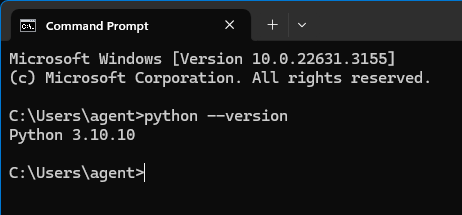
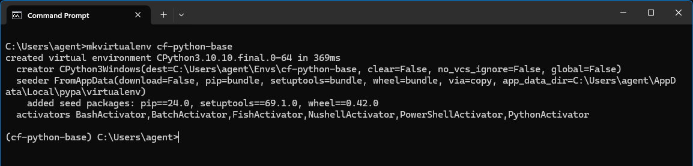
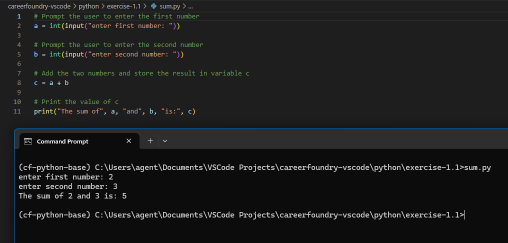
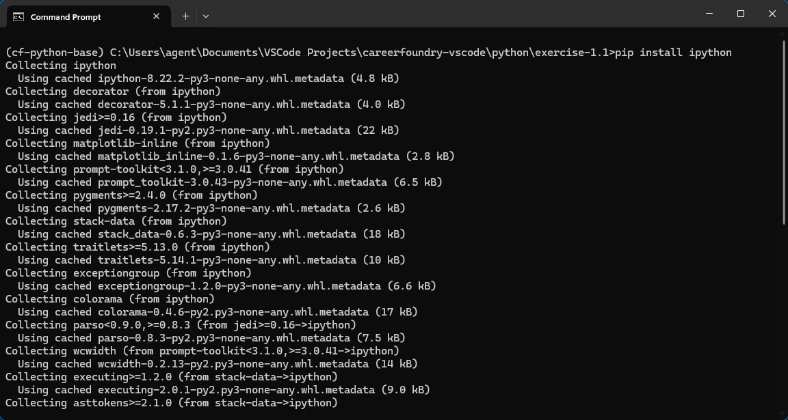
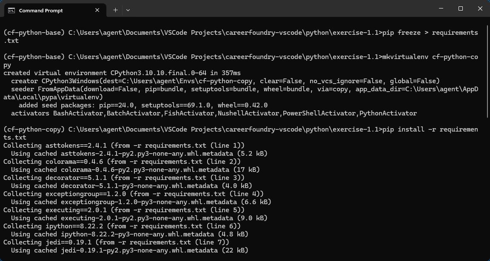

# Exercise 1
## Step 1 - Install Python
Install Python for your operating system and confirm that Python is installed by using the ```python --version``` command in your terminal.



## Step 2 - Set Up a Virtual Environment
Set up the [virtualenvwrapper-win](https://virtualenvwrapper.readthedocs.io/en/latest/install.html) package and then create a new virtual environment named "cf-python-base".



## Step 3 - Create a Python Script
Use your preferred text editor and create a Python script that prompts the user to input two numbers and adds them together, and then run the script from your terminal. The code for this is provided below.



```
# Prompt the user to enter the first number
a = int(input("enter first number: "))

# Prompt the user to enter the second number
b = int(input("enter second number: "))

# Add the two numbers and store the result in variable c
c = a + b

# Print the value of c
print("The sum of", a, "and", b, "is:", c)
```

## Step 4 - Set Up IPython Shell
Install the IPython Shell in the "cf-python-base" environment by running ```pip install ipython```. 
An IPython shell is similar to the regular Python REPL that you saw earlier but with additional features such as syntax highlighting, auto-indentation and robust auto-complete features. 

Verify your installation by launching an IPython shell with the command ```ipython```.



## Step 5 - Export and Use a Requirements File
The requirements file is a text file that lists package requirements for any particular Python application. The requirements file also helps when you’d like to run your Python script on another system. 

First, generate a “requirements.txt” file from the "cf-python-base" environment. To do this, you use the pip freeze command and all packages (including version numbers) installed in the currently activated environment will be compiled: ```pip freeze > requirements.txt```.

Next, create a new environment called “cf-python-copy” by running the command ```mkvirtualenv cf-python-copy```. In this new environment, install packages from the “requirements.txt” file that you generated earlier. 
To install the packages from this file in any other environment, you run the pip install command with the extra -r argument, followed by the name of your requirements file: ```pip install -r requirements.txt```.



# Exercise 2
## Step 1 - Create a structure for ```recipe_1```

The structure needs to contain the following keys:
- name (str): Contains the name of the recipe
- cooking_time (int): Contains the cooking time in minutes
- ingredients (list): Contains a number of ingredients, each of the str data type

For the structure of recipe_1, I would use a dictionary in Python. This is because a dictionary allows for easy association between keys and their corresponding values.

Here's the dictionary structure for the cup of tea recipe:
```
recipe_1 = {
    "name": "Tea",
    "cooking_time": 5,
    "ingredients": ["Tea leaves", "Sugar", "Water"]
}
```

## Step 2 - Create an outer structure called ```all_recipes```, and then add recipe_1 to it.

For the outer structure all_recipes, I would use a list of dictionaries. This allows for sequential storage of multiple recipes while maintaining the flexibility to add, modify, or remove recipes easily.

all_recipes = [recipe_1, ...other recipes]

I've also followed the same structure to create 4 more recipes and add them to the ```all_recipes``` list by using ```all_recipes.extend([recipe_2, recipe_3, recipe_4, recipe_5])```

## Step 3 - Print the ingredients of each recipe as five different lists

We can use a for loop to print the contents of the ingredients key of each recipe:

```
for recipe in all_recipes:
    print(recipe["ingredients"])

# Output
['Tea leaves', 'Sugar', 'Water']
['Eggs', 'Butter', 'Salt', 'Pepper', 'Milk']
['Spaghetti', 'Ground beef', 'Tomato sauce', 'Onion', 'Garlic', 'Parmesan cheese']
['Chicken', 'Curry powder', 'Coconut milk', 'Onion', 'Garlic', 'Ginger', 'Tomato']
['Flour', 'Sugar', 'Cocoa powder', 'Eggs', 'Butter', 'Milk', 'Vanilla extract']
```

# Exercise 1.3

## Step 1 - Initialize two empty lists: recipes_list and ingredients_list

```
recipes_list = []
ingredients_list = []
```

## Step 2 - Define a function called take_recipe, which takes input from the user for the following variables:
- name (str): Stores the name of the recipe.
- cooking_time (int): Stores the cooking time (in minutes).
- ingredients (list): A list that stores ingredients, each of the string data type.
- recipe (dictionary): Stores the name, cooking_time, and ingredients variables (e.g., recipe = {'name': name, 'cooking_time': cooking_time, 'ingredients': ingredients}).

```
def take_recipe():
    name = input("Name of the recipe: ")
    cooking_time = int(input("Cooking time (in minutes): "))
    ingredients = input("Ingredients (ex. Apples, Bananas, ...): ").split(", ")

    recipe = {
        "name": name,
        "cooking_time": cooking_time,
        "ingredients": ingredients
    }
    
    return recipe
```

## Step 3 - In the main section of your code, ask the user how many recipes they would like to enter. Their response will be linked to a variable n

```n = int(input("How many recipes would you like to enter? "))```

## Step 4 - Run a for loop, which runs n times to perform the following steps:

- Run take_recipe() and store its return output (a dictionary) in a variable called recipe.
- Run another for loop inside this loop, which iterates through recipe’s ingredients list, where it picks out elements one-by-one as ingredient. It will run the following step inside: if the chosen ingredient isn’t present in ingredients_list, add it to this list. To check if an element ele is present in a sequence seq, you can use the in keyword in a conditional statement as follows: if ele in seq:. Either True or False is returned (remember that you’re checking if ingredient is not in the list, so use the not operator accordingly).
- Once you’ve finished adding ingredients, append recipe to recipes_list.

```
for i in range(0,n):
    print("Recipe", i+1)
    recipe = take_recipe()

    for ingredient in recipe["ingredients"]:
        if not ingredient in ingredients_list:
            ingredients_list.append(ingredient)

    recipes_list.append(recipe)
```

## Step 5 - Run another for loop that iterates through recipes_list, picks out each element (a dictionary) as recipe, and performs the following steps:

1. Determine the difficulty of the recipe using the following logic:
    - If cooking_time is less than 10 minutes, and the number of ingredients is less than 4, set a variable called difficulty to the value of Easy.
    - If cooking_time is less than 10 minutes, and the number of ingredients is greater than or equal to 4, set a variable called difficulty to the value of Medium.
    - If cooking_time is greater than or equal to 10 minutes, and the number of ingredients is less than 4, set a variable called difficulty to the value of Intermediate.
    - If cooking_time is greater than or equal to 10 minutes, and the number of ingredients is greater than or equal to 4, set a variable called difficulty to the value of Hard.
  
2. Display the recipe in the following format, using values from each dictionary (recipe) obtained from recipes_list:
    

```
for recipe in recipes_list:
    difficulty = "Easy" if recipe["cooking_time"] < 10 and len(recipe["ingredients"]) < 4 else "Medium" if recipe["cooking_time"] < 10 and len(recipe["ingredients"]) >= 4 else "Intermediate" if recipe["cooking_time"] >= 10 and len(recipe["ingredients"]) < 4 else "Hard"

    print("\nRecipe: " + recipe["name"] + "\nCooking Time (min): " + str(recipe["cooking_time"]) + "\nIngredients:")
    for ingredient in recipe["ingredients"]:
        print(ingredient)
    print("Difficulty level:", difficulty)
```

## Step 6 - Next, you’ll have to display all the ingredients that you’ve come across so far in all of the recipes that you’ve just entered. In Step 5 you appended these ingredients into ingredient_list. Now it’s time to print them all out. Print them in alphabetical order, in a format similar to this example:


```
print("\nIngredients Available Across All Recipes\n-----------------------------------")
for ingredient in sorted(ingredients_list):
    print(ingredient)
```

# Exercise 1.4

## Part 1 - recipe_input.py script

### Step 1 - Import the pickle and os modules so you can work with binary files and interact with the files in your OS

```
import pickle
import os
```

### Step 2 - Define a function called take_recipe() to take recipes from the user, which performs the following operations:

- Taking in the recipe name, cooking time, and ingredients from the user.
- Calculating the difficulty of the recipe by calling thecalc_difficulty() function.
- Gathering all these attributes into a dictionary and returning it.

```
def take_recipe():
    name = input("Name of the recipe: ")
    cooking_time = int(input("Cooking time (in minutes): "))
    ingredients = input("Ingredients (ex. Apples, Bananas, ...): ").split(", ")
    difficulty = calculate_difficulty(cooking_time, ingredients)

    recipe = {
        "name": name,
        "cooking_time": cooking_time,
        "ingredients": ingredients,
        "difficulty": difficulty
    }

    return recipe
```

### Step 3 - Define the function calc_diffficulty(), where the difficulty is returned as Easy, Medium, Intermediate or Hard

```
def calculate_difficulty(cooking_time, ingredients):
    difficulty = "Easy" if cooking_time < 10 and len(ingredients) < 4 else "Medium" if cooking_time < 10 and len(
        ingredients) >= 4 else "Intermediate" if cooking_time >= 10 and len(ingredients) < 4 else "Hard"

    return difficulty
```

### Step 4 - Have the user enter a filename, which would attempt to open a binary file in read mode. Define a try-except-else-finally block as follows:

1. The try block will open the given file, and load its contents through the pickle module into a variable called data. If the file doesn't exist, the user will have an option to create it. The incoming data is expected to be a dictionary containing two key-value pairs:
    - recipes_list (a list of all recipes)
    - all_ingredients (a list of all ingredients across all recipes)
1. An except clause handles the FileNotFoundError exception if a file with the given name isn’t found. The code block after will create a new dictionary called data, which contains the recipes list under the key recipes_list and another list containing all the ingredients under all_ingredients.
1. Another except clause that handles other exceptions and performs the same operations as the first except block.
1. An else block that closes the file stream that would’ve been opened in the try block.
1. A finally block that extracts the values from the dictionary into two separate lists: recipes_list and all_ingredients.

```
filename = input("Enter the filename of your recipes: ")

try:
    if os.path.isfile("./" + filename):
        file = open(filename, 'rb')
        data = pickle.load(file)

        recipes_list = data["recipes_list"]
        all_ingredients = data["all_ingredients"]
        file.close()
        add_recipe()
    else:
        answer = input(
            "File doesn't exist, would you like to create and use it? (y/n) ")
        if answer == "y":
            add_recipe()
        elif answer == "n":
            print("Quitting...")
        else:
            print("Unrecognized command, quitting script...")

except FileNotFoundError:
    print("File doesn't exist - exiting.")
except:
    print("An unexpected error occurred.")
```

### Step 5 - Ask the user how many recipes they’d like to enter, and define a for loop that calls the take_recipe() function and then define an inner loop that scans through the recipe’s ingredients and adds them to all_ingredients if they’re not already there, then gather the updated recipes_list and all_ingredients into the dictionary called data

```
def add_recipe():
    # Ask user how many recipes they'd like to add
    n = int(input("How many recipes would you like to enter? "))

    # Take input for the number of recipes specified and append to recipe_list
    for i in range(0, n):
        print("Recipe", i+1)
        recipe = take_recipe()

        for ingredient in recipe["ingredients"]:
            if not ingredient in all_ingredients:
                all_ingredients.append(ingredient)

        recipes_list.append(recipe)

    data = {
        "recipes_list": recipes_list,
        "all_ingredients": all_ingredients
    }
```

### Step 6 - Finally, open a binary file with the user-defined filename and write data to it using the pickle module.

```
    file = open(filename, 'wb')
    pickle.dump(data, file)
    print('Data successfully written to "' + filename + '"')
    file.close()
```

## Part 2 - recipe_search.py Script

### Step 1 - Import the pickle module

```import pickle```

### Step 2 - Define a function to display a recipe called display_recipe(), which takes in one recipe (of the dictionary type) as an argument and prints all of its attributes including the recipe name, cooking time, ingredients, and difficulty

```
def display_recipe(recipe):

    print("\nRecipe: " + recipe["name"] + "\nCooking Time (min): " +
          str(recipe["cooking_time"]) + "\nIngredients:")
    for ingredient in recipe["ingredients"]:
        print(ingredient)
    print("Difficulty level:", recipe["difficulty"])
```

### Step 3 - Define another function called search_ingredient() to search for an ingredient in the given data. The function takes in a dictionary called data as its argument. The function will perform the following steps:

- First, it shows the user all the available ingredients contained in data, under the key all_ingredients. Each ingredient is displayed with a number (take the index of each ingredient for this purpose using the enumerate() function).
- Define a try block where the user gets to pick a number from this list. This number is used as the index to retrieve the corresponding ingredient, which is then stored into a variable called ingredient_searched.
- Make an except clause that warns the user if the input is incorrect.
- Add an else clause that goes through every recipe in data (hint: recipes_list is the key that holds every recipe). Each recipe that contains the given ingredient will be printed.

```
def search_ingredient(data):

    # making a copy of the data object to modify
    data_lower = data.copy()

    # convert all ingredients to lowercase so we can compare them regardless of which case they were originally in
    for recipe in data_lower["recipes_list"]:
        for ingredient in list(enumerate(recipe["ingredients"])):
            recipe["ingredients"][ingredient[0]] = ingredient[1].lower()

    for ingredient in list(enumerate(data_lower["all_ingredients"])):
        data_lower["all_ingredients"][ingredient[0]] = ingredient[1].lower()

    # turn all ingredients into a set which avoids duplicate ingredients, then sort it alphabetically
    all_ingredients = sorted(list(set(data_lower["all_ingredients"])))

    # show a list of all available ingredients
    print("\nAvailable ingredients:")
    for ingredient in list(enumerate(all_ingredients)):
        print(str(ingredient[0]+1) + ": " + ingredient[1])

    # display all recipes that include a user chosen ingredient
    try:
        ingredient_searched = int(input("\nSelect an ingredient from the list by entering its corresponding number: "))
    except:
        print("Invalid input, quitting...")
    else:
        try:
            print('\nList of recipes including ' + '"' +
                  all_ingredients[ingredient_searched - 1] + '":')
            for recipe in list(enumerate(data_lower["recipes_list"])):
                if all_ingredients[ingredient_searched - 1] in recipe[1]["ingredients"]:
                    print("\nRecipe " + str(recipe[0] + 1) + ": " + data["recipes_list"][recipe[0]]["name"] + "\nCooking Time (min): " + str(
                        data["recipes_list"][recipe[0]]["cooking_time"]) + "\nIngredients:")
                    for ingredient in data["recipes_list"][recipe[0]]["ingredients"]:
                        print(ingredient)
                    print("Difficulty level:",
                          data["recipes_list"][recipe[0]]["difficulty"])
        # handle exception where the inputted ingredient index is higher than what exists
        except IndexError:
            print("Item not found, quitting...")
```

### Step 4 - In the main code, ask the user for the name of the file that contains your recipe data

```filename = input("Enter the filename where you've stored your recipes: ")```

### Step 5 - Use a try block to open the file, and then extract its contents into data (from Step 3) using the pickle module. For when the try block fails, add an except block to warn the user that the file hasn’t been found. Define an else block that calls search_ingredient() while passing data into it as an argument.

```
try:
    file = open(filename, 'rb')
    data = pickle.load(file)
except FileNotFoundError:
    print("File doesn't exist - exiting.")
except:
    print("An unexpected error occurred.")
else:
    search_ingredient(data)
```
